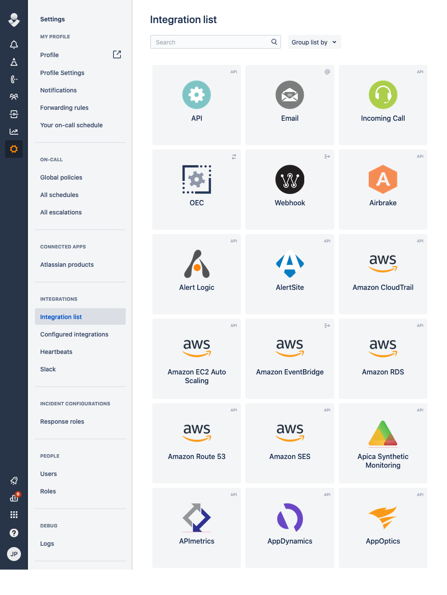
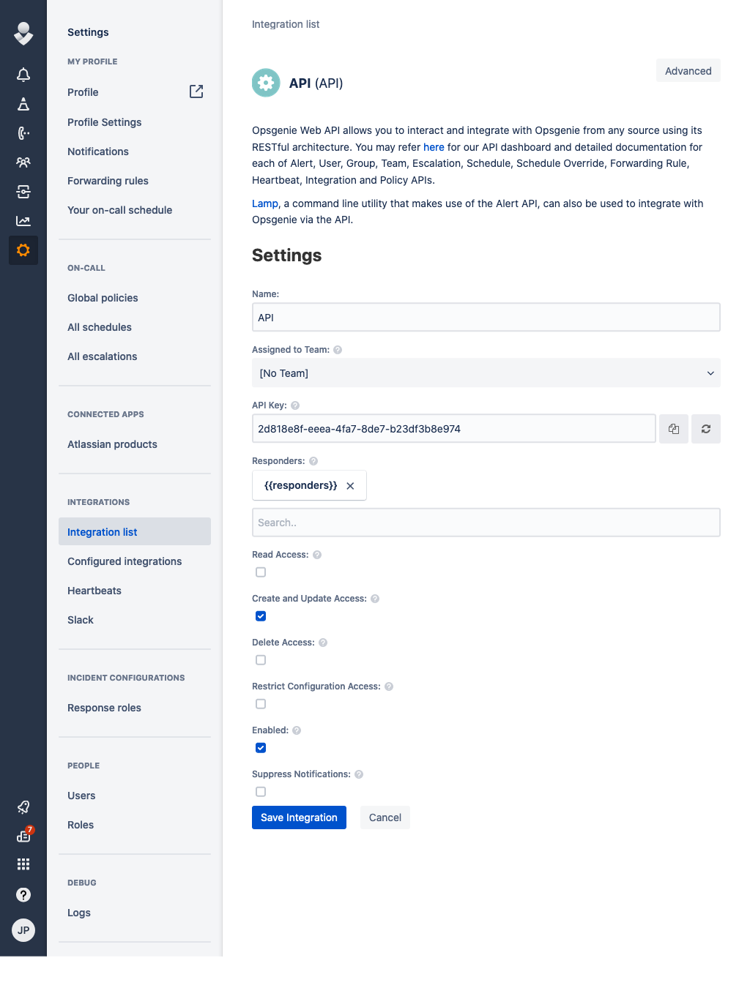

# OpsGenie

## URL Format

## Creating a REST API endpoint in OpsGenie

1. Open up the Integration List page by clicking on *Settings => Integration List* within the menu


2. Click *API => Add*

3. Make sure *Create and Update Access* and *Enabled* are checked and click *Save Integration*


4. Copy the *API Key*

5. Format the service URL

The host can be either api.opsgenie.com or api.eu.opsgenie.com depending on the location of your instance. See
the [OpsGenie documentation](https://docs.opsgenie.com/docs/alert-api) for details.

```
opsgenie://api.opsgenie.com/eb243592-faa2-4ba2-a551q-1afdf565c889
                            └───────────────────────────────────┘
                                           token
```

## Passing parameters via code

If you want to, you can pass additional parameters to the `send` function.
<br/>
The following example contains all parameters that are currently supported.

```gotemplate
service.Send("An example alert message", &types.Params{
    "alias":       "Life is too short for no alias",
    "description": "Every alert needs a description",
    "responders":  `[{"id":"4513b7ea-3b91-438f-b7e4-e3e54af9147c","type":"team"},{"name":"NOC","type":"team"}]`,
    "visibleTo":   `[{"id":"4513b7ea-3b91-438f-b7e4-e3e54af9147c","type":"team"},{"name":"rocket_team","type":"team"}]`,
    "actions":     "An action",
    "tags":        "tag1 tag2",
    "details":     `{"key1": "value1", "key2": "value2"}`,
    "entity":      "An example entity",
    "source":      "The source",
    "priority":    "P1",
    "user":        "Dracula",
    "note":        "Here is a note",
})
```

# Optional parameters

You can optionally specify the parameters in the URL:
opsgenie://api.opsgenie.com/eb243592-faa2-4ba2-a551q-1afdf565c889?alias=Life+is+too+short+for+no+alias&description=Every+alert+needs+a+description&actions=An+action&tags=["tag1","tag2"]&entity=An+example+entity&source=The+source&priority=P1&user=Dracula&note=Here+is+a+note

Example using the command line:

	shoutrrr send -u 'opsgenie://api.eu.opsgenie.com/token?tags=["tag1","tag2"]&description=testing&responders=[{"username":"superuser", "type": "user"}]&entity=Example Entity&source=Example Source&actions=["asdf", "bcde"]' -m "Hello World6"

